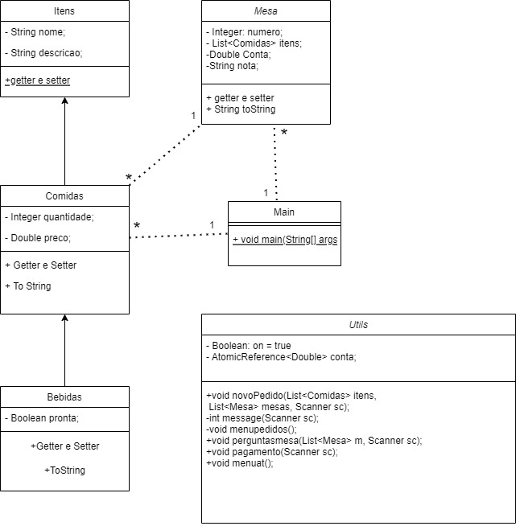

# Restautaurante da Dona Florinda

Desenvolvemos um software de comanda digital é uma solução tecnológica inovadora que substitui as tradicionais comandas em papel utilizadas em restaurantes.
Ele permite aos clientes visualizarem o cardápio, fazerem pedidos, solicitar pagamentos e realizar outras interações diretamente de seus dispositivos móveis,
como smartphones ou tablets.

## Entendendo a aplicação

Se trata de um sistema que trabalha com listas de opções e atendimento de clientes, responsavel por divisão de mesas e pagamentos.

### Pre-requisitos

Requisitos para o software e outras ferramentas para construir, testar e implantar.

- JDK ou JRE 18

## Versionamento

Nós usamos [git](https://git-scm.com/) para o versionamento. para todas as versões disponiveis, veja [github](https://github.com/FelipeKTrigo/restaurante_da_dona_florinda).

## Autores

- **Felipe Knoner Trigo - 182673** -

- **André Pereira Russo- 183261** -

- **Carlos Eduardo Soares de Jesus- 060277** -

- **João Victor Cardoso Correa - 181225** -

- **Danilo de souza goncalves - 178927** -

- **Nycollas Marcelino de Oliveira - 173488** -

## Diagrama de classes
